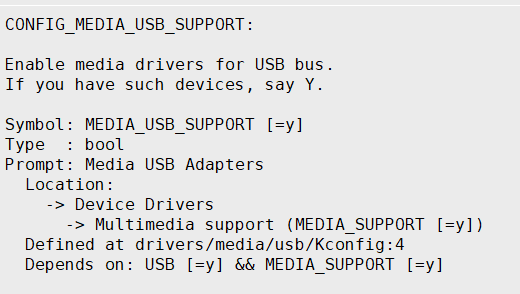
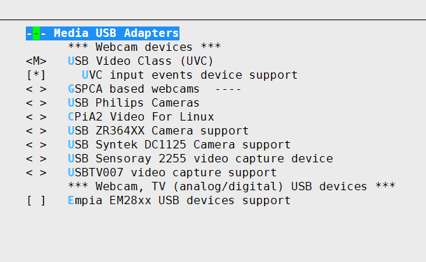
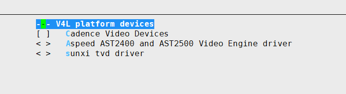

# USB摄像头使用说明

## USB摄像头kernel配置

## 需要的驱动文件：

路径：

tina-d1-v1.1/lichee/linux-5.4/drivers/media/usb/uvc/uvcvideo.ko

tina-d1-v1.1/lichee/linux-5.4/drivers/media/common/videobuf2/videobuf2-vmalloc.ko

tina-d1-v1.1/lichee/linux-5.4/drivers/media/common/videobuf2/videobuf2-memops.ko

videobuf2-vmalloc.ko

videobuf2-memops.ko

uvcvideo.ko

## 安装驱动命令：

ko文件路径：/lib/modules/5.4.61

insmod videobuf2-vmalloc.ko

insmod videobuf2-memops.ko

insmod uvcvideo.ko

## USB摄像头demo使用说明：

路径：/driver_210601

gcc usbcamera_demo.c -o usbcamera_demo

./usbcamera_demo

